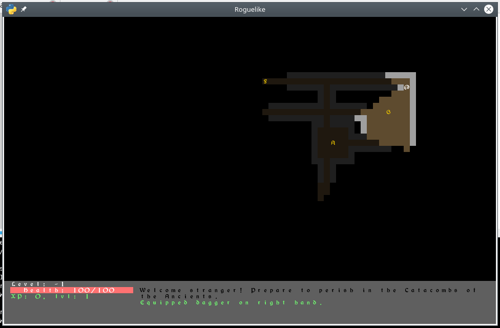

=======
pyRogue
=======

:date: 2018-12-17
:modified: 2020-04-04
:status: tutorial
:version: $Id: README.rst 1.5 $
:licence: SPDX-License-Identifier: BSD-2-Clause

Results from following `roguebasin.com <http://www.roguebasin.com/index.php?title=Roguelike_Tutorial,_using_python3%2Btdl>`_ python3 + tdl tutorial.

Warning: ``tdl module is now deprecated.``, need ``libsdl2-dev`` installed.

Game:
=====

Playable and 'Fun'. Don't overthink. Flee, avoid, run away. Grab, use and try to survive as long as you can.

It's a rogue game. You will die soon, or sooner. And you'll start all over again.

Controls:

* 'arrows' to move and attack
* 'g': grab thing
* 'i': show inventory
* '<': go downstairs (one way, there is no turning back!)
* 'ESC' to quit (or 'c' at main menu)

``There's nothing to find, apart from wretched death...``

What's in chapters:
===================

Code snipsets. They were used to test code, for each tutorial's chapter.

* rogue_test00.py
* rogue_test01.py
* rogue_test02.2.py
* rogue_test02.py
* rogue_test03.py
* rogue_test04.py
* rogue_test05.py
* rogue_test06.py
* rogue_test07.py
* rogue_test08.py
* rogue_test09.py
* rogue_test10.py
* rogue_test11.py
* rogue_test12.py
* rogue_test13.py
