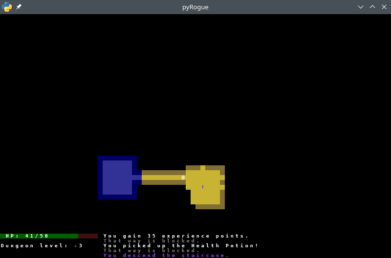

=======
pyRogue
=======

.. meta::
    :date: 2018-12-17
    :modified: 2021-05-28

:status: tutorial, playable
:version: $Id: README.rst 1.11 $
:licence: SPDX-License-Identifier: BSD-2-Clause

This is a little *Rogue-like* game, from following `roguebasin.com <http://www.roguebasin.com/index.php?title=Roguelike_Tutorial,_using_python3%2Btdl>`_ python3 + tdl tutorial.

Warning: ``tdl module is now deprecated.``, need ``libffi-dev``, ``libsdl2-dev`` installed. 

There's room for lots and lots of improvements. See TODO. Opensource licence, feel free to fork and PR back.

Rogue Game:
===========

Playable and 'Fun'. Don't overthink: Flee, avoid, run away. Grab, use and try to survive as long as you can, on infinite levels...

It's a rogue game. You will die soon, or sooner. And you'll start all over again.

``There's nothing to find, apart from wretched death...``

Controls:

* 'arrows' to move and attack (no diagonals)
* 'g': grab thing
* 'i': show inventory
* 'x': show player's statistics
* '<': go downstairs (one way, there is no turning back!)
* 'ESC' to quit (or 'c' at main menu)

Display:

* '@': you
* 'A': any capital letter is the name of the room
* '+': a potion
* '#": a scroll
* 'o': an Orc
* 'T': a Troll
* '/': a sword
* '[': a shield
* '<': stairs, they go deeper...

Current state will be saved (savegame.db), if you quit.

What's in chapters:
===================

Code snippets. They were used to test code, from each tutorial's chapter.

* dejavu10x10_gs_tc.png   <- font, as image
* dundalk12x12_gs_tc.png  <- another font, also as image
* menu_background1.png    <- image for the menu (from http://roguecentral.org/doryen )
* roguecolors.py          <- color definitions
* rogue_test00.py
* rogue_test01.py
* rogue_test02.2.py
* rogue_test02.py
* rogue_test03.py
* rogue_test04.py
* rogue_test05.py
* rogue_test06.py
* rogue_test07.py
* rogue_test08.py
* rogue_test09.py
* rogue_test10.py
* rogue_test11.py
* rogue_test12.py
* rogue_test13.py
